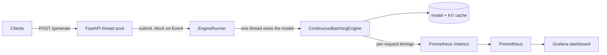

# LLM Inference Server


An inference server for causal language models built around **continuous
batching**: the scheduling technique that lets one model serve many concurrent
requests without making short requests wait behind long ones. The batching engine
is implemented from scratch over Hugging Face `transformers` rather than delegated
to a serving framework, because the point of the project is the scheduling and the
KV-cache bookkeeping that make batching correct.

Decoding is greedy, which makes each request's output a deterministic function of
its prompt. That is what lets the tests assert the property that matters: **sharing
a forward pass with other requests does not change a single token you receive.**

## The problem

Generating text is memory-bound. Most of a decode step is spent streaming the
model's weights from memory, and that cost is paid once per step no matter how many
sequences ride along. Serving one request at a time therefore leaves the machine
mostly idle.

The obvious fix, collecting N requests and generating for all of them at once
(*static batching*), has a flaw: the batch runs until its slowest member finishes,
so a request asking for 4 tokens is held hostage by one asking for 200, and slots
freed by finished requests sit empty until the whole batch is done.

## Continuous batching

Continuous batching schedules at the granularity of a single decode iteration
instead of a whole request:

- a finished sequence leaves the batch immediately, freeing its slot,
- a waiting request joins at the very next iteration.

That is the entire idea. The work is in keeping the key/value cache consistent
while the batch composition churns underneath it. Sequences hold different numbers
of tokens, so they are aligned by **left-padding** the cache, which keeps the newest
token of every sequence at the same index and lets one forward pass advance the
whole batch by a token. An attention mask stops the model from ever attending to the
padding. When a sequence is admitted its cache is concatenated onto the running
batch; when one finishes its rows are cut out and any padding no surviving sequence
needs is trimmed. This lives in [`src/cache_ops.py`](src/cache_ops.py); the
scheduling loop that drives it is in [`src/engine.py`](src/engine.py).

## Architecture



One thread owns the model and the KV cache and nothing else touches them. Requests
arrive on FastAPI's thread pool, are handed to the engine thread under a lock, and
their handlers block on an `Event` until the engine finishes them. Keeping every
tensor operation on a single thread is what makes the cache surgery safe without any
locking of its own.

## The trade-off

Continuous batching buys throughput by sharing decode steps, and pays for it in
per-token latency: a fuller batch makes each forward pass do more work, so the gap
between one token and the next widens. That trade is the whole point, so the
benchmark measures both ends of it.

Both arms run the same model on the same prompts and decode greedily, so they
produce byte-identical output; the only difference is whether decode steps are
shared. Measured on `distilgpt2`, CPU, 16 requests of 32 new tokens each, reported
as the median of 3 runs:

| Batch | Throughput (tok/s) | vs sequential | Forward passes | TTFT p50 | Inter-token latency p50 |
|------:|-------------------:|--------------:|---------------:|---------:|------------------------:|
|     1 |               51.2 |         1.00x |            513 |    4.72s |                  19.2ms |
|     2 |               72.3 |         1.41x |            257 |    3.15s |                  27.3ms |
|     4 |              105.6 |         2.06x |            129 |    1.81s |                  34.1ms |
|     8 |              157.7 |         3.08x |             65 |    1.02s |                  47.3ms |
|    16 |              213.2 |         4.16x |             33 |    0.28s |                  68.4ms |

Reading the table: batching 16 requests cuts the number of forward passes from 513
to 33 and lifts throughput about 4x, while inter-token latency rises from 19ms to
68ms. Time-to-first-token falls here because this benchmark enqueues every request
at once, so a larger batch admits more of them in the first prefills instead of
making the last request wait for fifteen others to finish; in an already-saturated
server a new arrival would instead wait for a slot, which is the case the queue-depth
and TTFT metrics exist to watch. The output was byte-identical to the sequential
baseline at every batch size.

Numbers vary with machine load; the engine is CPU-only here because the development
machine has no GPU, so treat the ratios, not the absolute rates, as the result.

```bash
python -m src.benchmark --requests 16 --batch-size 8 --max-new-tokens 32
```

## Quick start

```bash
pip install -r requirements.txt
uvicorn src.serve:app
```

The first request triggers a one-time model download. Generate:

```bash
curl -X POST localhost:8000/generate -H 'Content-Type: application/json' \
  -d '{"prompt":"The future of machine learning infrastructure","max_new_tokens":32}'
```

Or bring up the server with its monitoring stack:

```bash
docker compose up --build
```

| Service | URL |
|---|---|
| API | http://localhost:8000 |
| Swagger docs | http://localhost:8000/docs |
| Prometheus | http://localhost:9090 |
| Grafana | http://localhost:3000 (admin / admin) |

The model is selected with `MODEL_NAME` (any causal LM on the Hub; defaults to
`distilgpt2`) and the batch ceiling with `MAX_BATCH_SIZE`.

## API

| Method | Endpoint | Description |
|---|---|---|
| GET | `/health` | Readiness probe |
| POST | `/generate` | Generate text for a prompt |
| GET | `/stats` | Current model, batch ceiling, running and queued counts |
| GET | `/metrics` | Prometheus metrics |

## Monitoring

Request latency is the wrong headline number for generation: a request that streams
its first token in 40ms then produces 200 more feels fast, and one that takes the
same total time but shows nothing for two seconds feels broken. The metrics are
built around the two numbers that actually describe the experience, plus the batch
size that trades one against the other.

- `llm_time_to_first_token_seconds` histogram: queue wait plus prefill
- `llm_inter_token_latency_seconds` histogram: mean gap between tokens within a request
- `llm_running_batch_size` and `llm_queue_depth` gauges: the batch and the backlog
- `llm_decode_step_seconds` histogram: wall time of one decode iteration
- `llm_tokens_generated_total` and `llm_requests_total` counters: throughput

The Grafana dashboard under [`monitoring/`](monitoring/) is provisioned
automatically and plots all of these.

## What this does not do

Being explicit about the edges, because they are where the interesting questions
live:

- **Greedy decoding only.** No temperature, top-k or top-p sampling. This is a
  deliberate choice: determinism is what makes the correctness property testable.
  Adding sampling with a fixed seed per request would preserve it.
- **No paged attention.** The KV cache is padded and copied on every batch change,
  which is O(tokens) work per admission and eviction. vLLM's paged attention stores
  the cache in fixed blocks and avoids the copies; that is the next thing this design
  would need to scale.
- **No token streaming.** A request returns its full completion in one response;
  there is no server-sent-events endpoint yet, even though the engine produces tokens
  incrementally and could stream them.
- **Single process.** One engine thread owns one model on one machine. Scaling out
  means running several replicas behind a load balancer; there is no tensor or
  pipeline parallelism.
- **CPU only.** Developed without a GPU. The code is device-agnostic and moving the
  model and cache tensors to CUDA would work, but the numbers above are CPU numbers.
- **No cross-request prefix sharing.** Requests with a common prompt prefix each keep
  their own cache rather than sharing it.

## Tests

The correctness property is asserted, not assumed. The suite checks that a batched
request receives exactly the tokens it would have received alone, including when it
joins a batch that is already mid-flight (which exercises cache merging, left padding
and eviction at once), that the batch ceiling is never exceeded, that a finished
sequence leaves immediately, and that the cache is released when the batch drains.
The cache operations are tested directly for correct left padding, row selection and
padding trims.

```bash
pytest tests/ -v
```

## License

Released under the MIT License. See [LICENSE](LICENSE).
